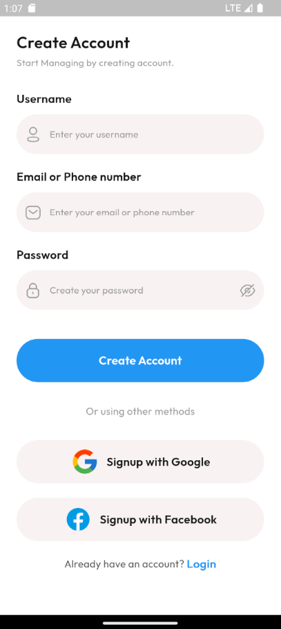
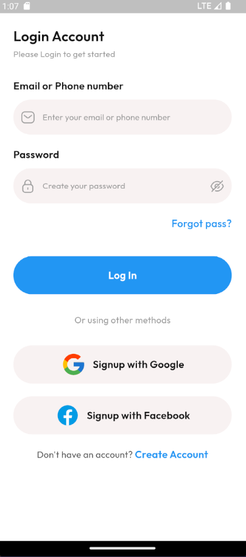
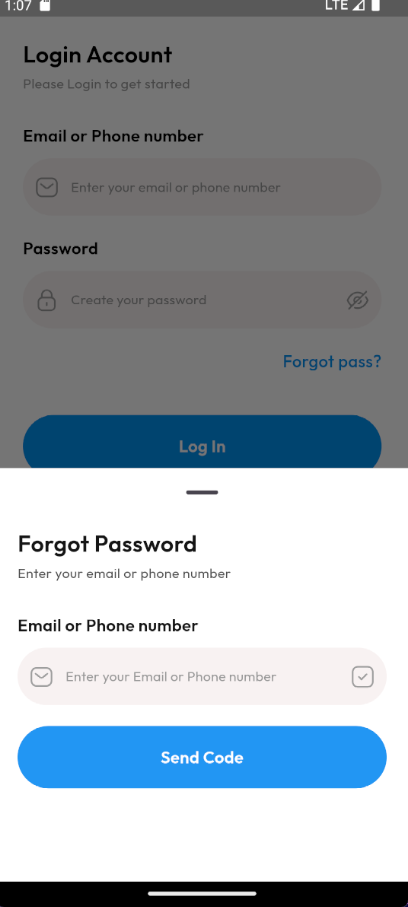
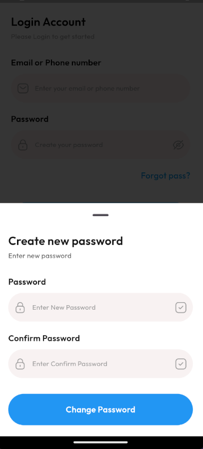
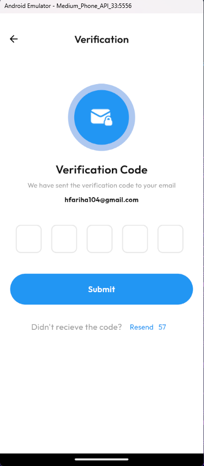

# 📋 Project Management Application

## 🚀 Overview
This Flutter-based **Project Management App** is designed to simplify and streamline your project workflows. For now, it features **authentication modules**, with more to come in future updates. Stay tuned!

## 🔐 Current Functionality

### 🖥️ Screens
- **🔑 Login Screen** – Secure user login with email and password.
- **📝 Signup Screen** – Easy registration for new users.
- **❓ Forgot Password Screen** – Password recovery made simple.
- **🔄 New Password Screen** – Set up a new password after recovery.
- **✔️ Verification Screen** – Email or phone number verification for added security.
- **👤 User Update Screen** – Personalize your profile with update options.
- **🏗️ Workspace Screen** *(in progress)* – Manage your workspaces and projects with ease.

## 📦 Additional Features
- **📱 Responsive Design** – Ensures the app looks great on all devices, from mobile to desktop.
- **🛠️ Custom Widgets** – Modular and reusable components for a smooth user experience.
- **🎨 Themes & Custom Styles** – A beautifully designed UI with themes and consistent styling.
- **🔧 Constants Files**:
  - 🎨 **Colors**
  - ✍️ **Text**
  - 🖼️ **Images**
  - 🖼️ **SVGs**
  - 📐 **Dimensions**
- **🔄 Routing & Navigation** – Easily navigate through the app with seamless transitions.
- **⚡ State Management** – Efficient state handling using **GetX** for smooth performance and reactive UI.

## 📸 Screenshots

  
  

  
  

  
  

## 🌐 Let's Connect
- [LinkedIn](https://www.linkedin.com/in/fareha-hassan-90a7b7221/) – Let's network and grow!
- [Instagram](https://www.instagram.com/farehadev) – Follow me for tech updates and more!

## ⭐ Support
If this project helps you in any way, don't forget to give it a **star** on GitHub! Your support helps in continuous development and improvements.

